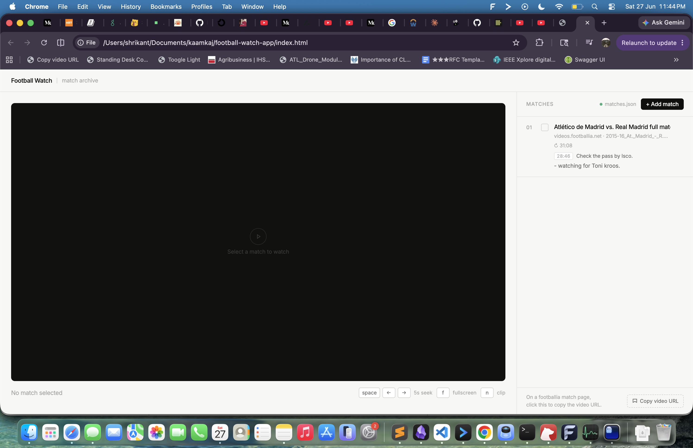

# Football Watch

A minimal personal archive for watching football match videos from [footballia.net](https://footballia.net). Single `index.html` file — no framework, no build step, no server required.



---

## Features

**Two-panel layout** — video player on the left, match archive on the right.

**Keyboard shortcuts**
| Key | Action |
|-----|--------|
| `Space` | Play / Pause |
| `←` `→` | Seek ±5 seconds |
| `F` | Toggle fullscreen |
| `N` | Add a timestamped clip at current position |

**Match archive**
- Add matches by pasting a direct `.mp4` URL
- Editable description per match
- Free-text notes field
- Watched / unwatched toggle

**Timestamped clips** — press `N` while watching to save the current timestamp with a note. Click any clip to jump back to that moment.

**Resume playback** — position is saved automatically when you pause or switch matches. Reopen the app and pick up exactly where you left off.

**File system persistence** — data lives in a `matches.json` file you choose on your disk. Survives browser clears, profile resets, and incognito mode. Falls back to `localStorage` if no file is connected.

**Bookmarklet** — drag the "Copy video URL" link to your bookmarks bar. On any footballia match page, click it to copy the `.mp4` URL directly to your clipboard.

---

## Usage

Open `index.html` in Chrome (or any browser with File System Access API support).

On first launch, you'll be prompted to create or open a `matches.json` file — this is where all your match data is stored.

To add a match:
1. Go to a match page on footballia.net and click the **Copy video URL** bookmarklet
2. Click **+ Add match** in the app and paste the URL

---

## Data format

Matches are stored as plain JSON — easy to inspect, back up, or edit manually.

```json
[
  {
    "id": "1234567890",
    "url": "https://videos.footballia.net/...",
    "desc": "Atlético de Madrid vs. Real Madrid — La Liga 2015-16",
    "notes": "Watching for Toni Kroos.",
    "position": 2723,
    "watched": false,
    "clips": [
      { "id": "1234567891", "t": 1726, "note": "Check the pass by Isco." }
    ]
  }
]
```
